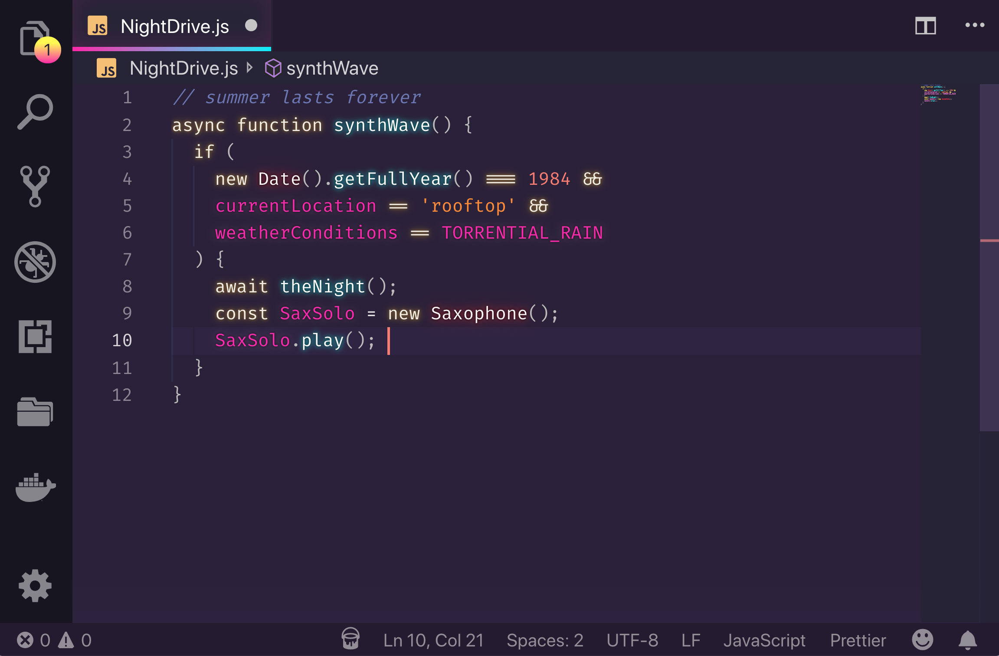
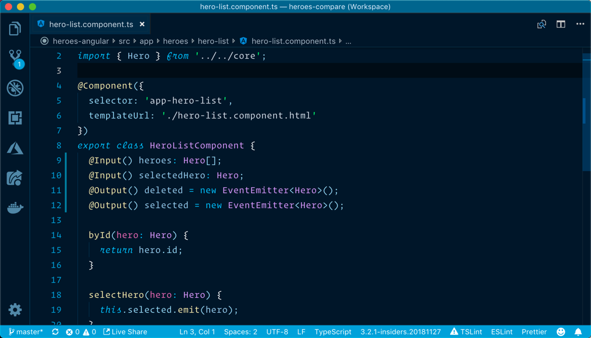
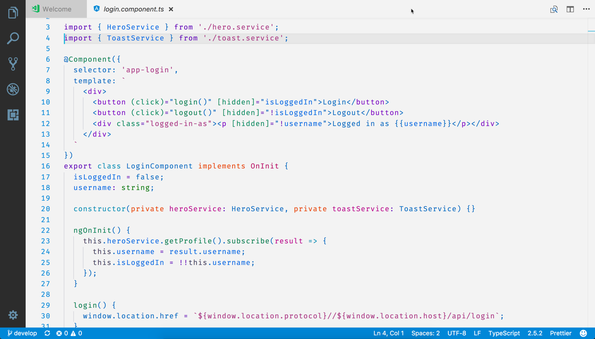

--- 
layout: "post"
title: "VScode Themes"
categories: "IDE"
---

Dans cet article, je vais lister mes thèmes pour Visual Studio Code préférés.  
Je travaille le plus souvent en mode sombre, je trouve cela beaucoup plus reposant pour les yeux, et quand on passe des heures devant l'écran, cela compte beaucoup. 

## SynthWave 84'

J'apprécie beaucoup ce thème, les couleurs sont très agréables pour le dév. (Je l'ai testé avec Angular) Le côté années 80 est plutôt sympa. 

Voici un exemple : 

Vous pouvez le télécharger directement via le Marketplace de Visual Studio : [Synthwave 84'](https://marketplace.visualstudio.com/items?itemName=RobbOwen.synthwave-vscode)

## Winter is Coming 

Un beau petit thème sombre inspiré de la famille Stark. Plus simple que le précédent mais avec tout de même une belle coloration syntaxique, propre et très lisible. 

Exemple : 

Un peu moins fan du mode "light" mais il a le mérite d'exister et est installé avec l'extension. 

Exemple :

C'est tout pour le moment ! Si j'en vois de nouveaux je mettrai ce post à jour :+1: 